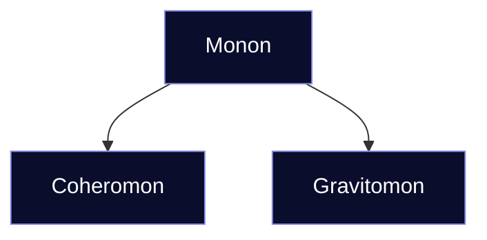

# 🪐 The Hierarchy of Mononic Systems

# Ontic Regimes

**Ontic Regimes** describe the dominant cohesive forces that define how matter and energy maintain unity.  
> They mark the transition from subatomic to cosmic coherence — **from nuclei to stars and beyond.**

| **Regime** | **Binding Force** | **Scale** | **Examples** |
|:--|:--|:--|:--|
| **Nuclear Regime** | Strong and weak nuclear forces | Atomic nuclei | neutronium, fusion cores |
| **Molecular Regime** | Electromagnetic bonding | Molecular and crystalline matter | lithic, rheic, aeric bodies |
| **Gravitational Regime** | Self-gravitation | Planetary and stellar bodies | planemons, stellamons, peramons |
| **Field Regime** | Energetic or spacetime curvature fields | Relativistic or exotic matter | black holes, cryptomons, hyperstellamons |

Each regime represents a distinct **mode of coherence**, determined by the dominant physical interaction at its scale.  
Together they form the backbone of **Ontic hierarchy**, linking the smallest bound particle to the largest self-coherent body.

## 1 · Monons — The Singular

A **Monon** is any independent, self-coherent body: a planet, a star, a grain of sand, or a drop of water.

It is the fundamental *unit of being* in the WMB ontology.

Monons come in two structural forms:
- **Coheromons** — bodies held together by *cohesion* (molecular bonding)
- **Gravitomons** — bodies held together by *self-gravity*
    
This distinction defines the two great branches of mononic existence.

|Tier|Full Form|Common Form|Binding Principle|Example|
|:--|:--|:--|:--|:--|
|**Monon**|—|–mon|Self-coherence|any singular body|
> Monon is the umbrella class; specific binding regimes are defined under Coheromon and Gravitomon.
## 2 · Cules — Unity by Likeness
The suffix **–cule** (from *–culon*, “small body”) marks a directly bound group of **similar monons**.  

Cules are **homogeneous** systems: members of the *same* Mononic Class bound together by a shared orbit, field, or gravitational structure.

| Example             | Canonical Term             | Description                                            |
| :------------------ | :------------------------- | :----------------------------------------------------- |
| two planets         | **duacule < duaculon**     | binary pair of *gravitomons* (a classic double planet) |
| three stars         | **ternacule < ternaculon** | trinary of *stellamons*                                |
| four or more        | **multicule < multiculon** | homogeneous multiple system                            |
| spoken contractions | *quadrule*, *quinule*      | vowel–prefix elision for euphony                       |

> **Euphonic rule:**  
> When a **vowel-final numeral prefix** precedes **–cule**, both the **terminal vowel of the prefix** *and* the initial **c** of –cule may be elided for ease of pronunciation.

Examples:
- *quadracule → quadrule*
- *quinacule → quinule*
- *triacule → triule*
>  
> **Concept:** Cules express **unity by resemblance** — kinship, symmetry, and common class membership.

## 3 · Lexes — Unity by Connection
The suffix **–lex** (from *–plexon*, related to “complex,” meaning *to weave, entwine*) marks a bound group of **unlike monons or cules**.  
Lexes are **heterogeneous** systems: members of differing **Mononic Classes** woven together through shared orbits, fields, or dynamical relationships.

| Example                 | Canonical Term                            | Description                                             |
| :---------------------- | :---------------------------------------- | :------------------------------------------------------ |
| star + planets          | **Stellalex < Stellalexon**               | Stellamon primary with duramons or peramons             |
| planet + moons          | **Duralex < Duralexon**                   | Duramon primary with subsidiary bodies                  |
| resonance chain         | **Peralex < Peralexon**                   | Peramonic network (e.g., binary or chained black holes) |
| trinary stars + planets | **Stellar Ternalex < Stellar Ternalexon** | three stars with planetary companions                   |
| spoken contractions     | *quinex*, *ternex*                        | vowel-prefix elision allowed                            |
> **Euphonic rule:**
> When a **vowel-final numeral prefix** precedes **–lex**, both the **terminal vowel of the prefix** *and* the initial **l** of –lex may be elided for ease of pronunciation. (*quinex* < *quinalex*).  
>  
> **Concept:** **Lexes express unity by relationship** — interdependence, function, and dynamic structure among *unlike* members.

## 4 · Gates — Unity by Context
The suffix **–gate** (from *aggregate*, Latin *aggregare*, “to bring together”) denotes **macro-systems** composed of multiple **Lexes** or **Cules**.  
Gates are **contextual collectives**: systems whose coherence arises not from direct binding, but from shared fields, topology, or cosmic environment.

| Example              | Canonical Term              | Description                          |
| :------------------- | :-------------------------- | :----------------------------------- |
| pair of galaxies     | **Duagate < Duagation**     | binary aggregate                     |
| triple galaxy system | **Ternate < Ternagation**   | triple aggregate                     |
| galaxy cluster       | **Multigate < Multigation** | many-membered aggregate              |
| cosmic filament      | **Stellagate / Peragate**   | vast stellar or peramonic collective |
> **Concept:** **Gates express unity by context** — coherence defined not by resemblance or interaction, but by large-scale gravitational, spatial, or environmental connection.

## 5 · Summary Hierarchy
| Level     | Full form → Common form | Binding principle | Composition            | Example                        |
| :-------- | :---------------------- | :---------------- | :--------------------- | :----------------------------- |
| **Monon** | — → –mon                | Self-coherence    | singular body          | coheromon, gravitomon          |
| **Cule**  | –culon → –cule          | Likeness          | homogeneous grouping   | binary planets, trinary stars  |
| **Lex**   | –lexon → –lex           | Connection        | heterogeneous grouping | star + planets, planet + moons |
| **Gate**  | –gation → –gate         | Context           | collective field       | galaxy, cluster, filament      |
> Monons divide into _Coheromons_ (cohesion-bound) and _Gravitomons_ (gravity-bound).  
> Cules, Lexes, and Gates operate at system scales built from monons or higher aggregations.
## 6 · Conceptual Symmetry
- **–Cule** = _unity by sameness_ (kinship)
- **–Lex** = _unity by difference_ (interaction)
- **–Gate** = _unity by context_ (collective field)
   
Each suffix is **dimensionless** — it defines a _mode of coherence_, not a scale.  
A cule may be small or enormous; a gate may span a few lexes or an entire cluster.  
The suffix marks _how_ the system coheres, not _how big_ it is.

> **Monon → Cule → Lex → Gate**  
> — from the One that coheres, to the Few that resemble, to the Many that relate, to the Vast that contain.
